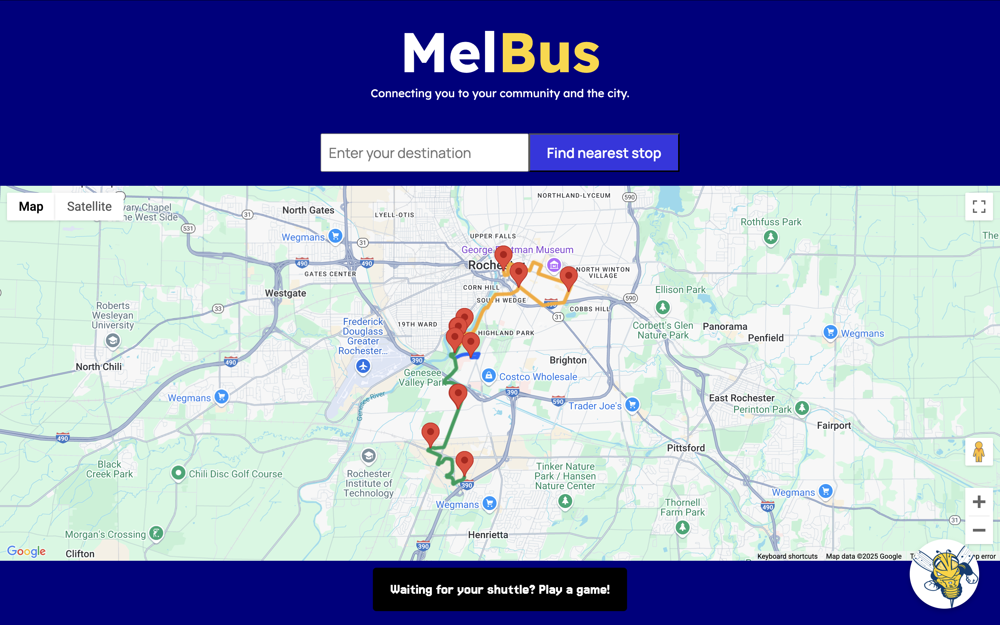
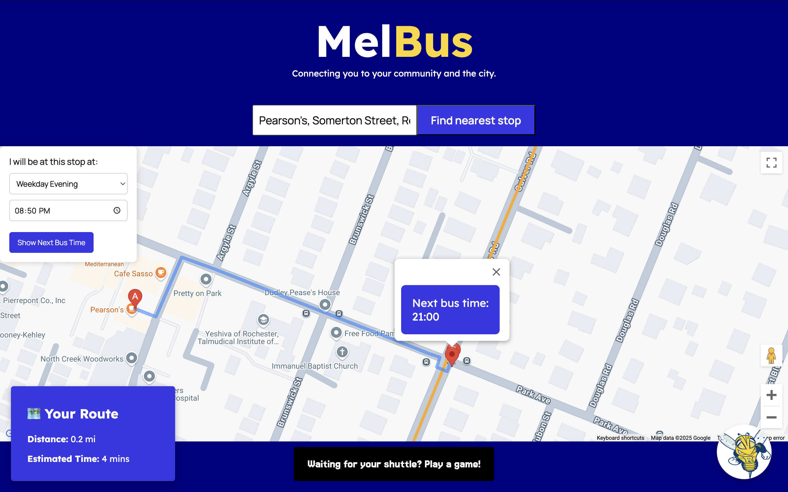
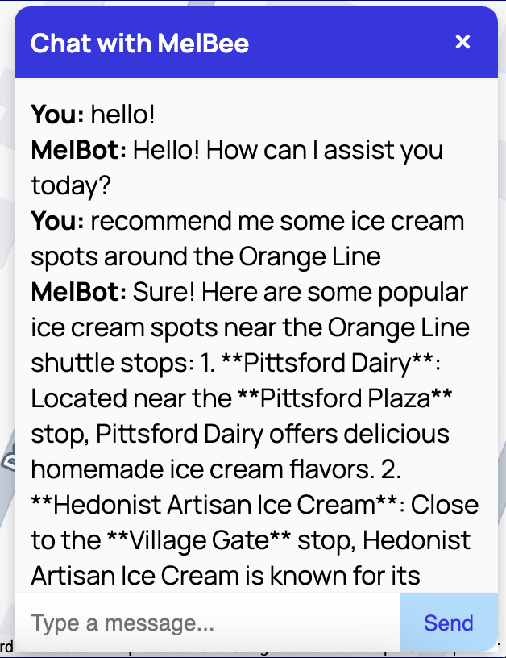

# MelBus 
## University of Rochester's Shuttle Route Enhancer!

Submitted for DandyHacks 2024 by: Lucy Ming, Javlonbek Khamzaev, Artan Kadriju

## Features

### 1) Route-finder & Navigator

* Helps the user find the fatest route to ANY spot in the city using UofR's shuttles
* Pinpoints the specific geolocation of shuttle stops, for easy navigation to and from shuttle stops
* Calculates the distance and walking time to and from a shuttle stop

### 2) AI chatbot (MelBee)

* Provides food, recreation and entertainment recommendations in Rochester, based on areas near UofR's shuttle routes

### APIs utilized
* Google Maps Javascript API
* Google Maps Places API
* OpenAI API

### Extent of Implementation
* Shuttle routes included: Orange line, Green line, Blue line
 
Happy Commuting! 🚍
